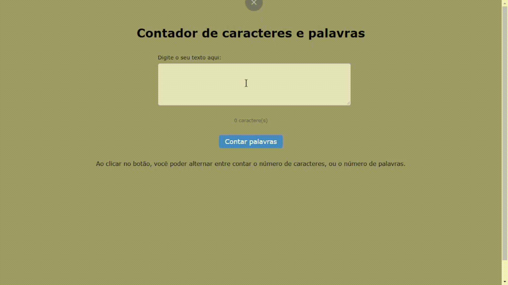

<h1 align="center"> Contador de palavras e caracteres </h1>

  <a href="#-tecnologias">Tecnologias</a>&nbsp;&nbsp;&nbsp;|&nbsp;&nbsp;&nbsp;
  <a href="#-projeto">Projeto</a>&nbsp;&nbsp;&nbsp;|&nbsp;&nbsp;&nbsp;
  

 

  

## 💻 Projeto

Este é um projeto que pode contar quantas palavras foram digitadas separadamente, ou quantos caracteres foram digitados, usando JavaScript.

## 🚀 Tecnologias

Esse projeto foi desenvolvido com as seguintes tecnologias:

- HTML e CSS
- JavaScript
- Git e Github
